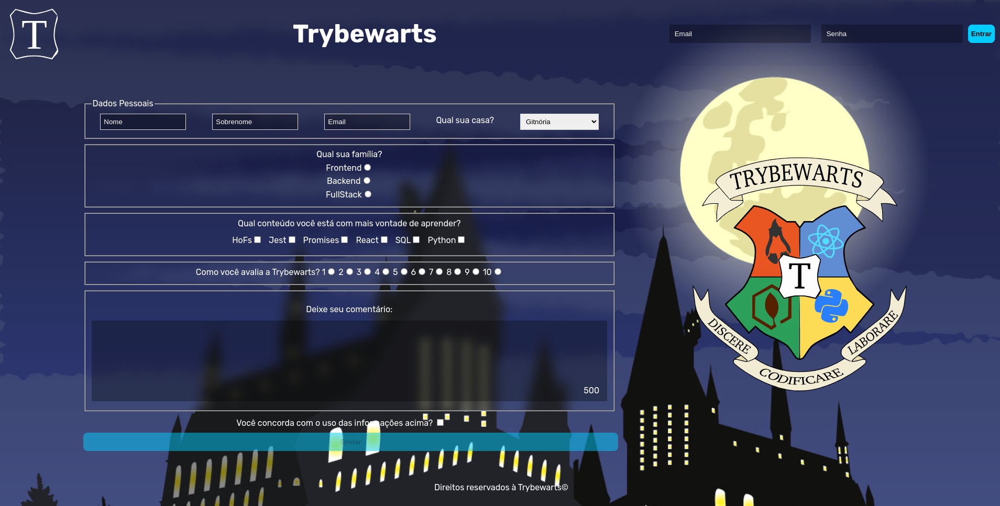

# Seja muito bem-vindo(a) ao meu projeto Trybewarts! :rocket:

Neste projeto realizeei em grupo, a confecção de um forms responsivo com HTML, CSS e JavaScript!

## Link para acessar o projeto
### <b> <a href="https://khallylreisfonseca.github.io/Pixels-Art-Project/">Pixel Art</a> </b>  

## Screenshot

## Objetivos
  * Criar paleta de cores com 8 cores, sendo preto e branco as primeiras (pré-selecionadas) e outras sete cores randômicas;
  * Criar um board medindo 5x5 unidades;
  * Pintar cada unidade pixel com a cor selecionada ao se clicar;
  * Criar um botão de limpar board;
  * Criar um campo de input que permite alterar o tamanho do board (entre 25 e 625 unidades);

## Tecnologias usadas
  * HTML
  * CSS
  * Javacript
  * DOM
  * HTML Semântico  

## Como usar
  Basta acessar a página, configurar o tamanho do board ou utilizar o pré-definido e interagir com o quadro de pixels.
   
   
