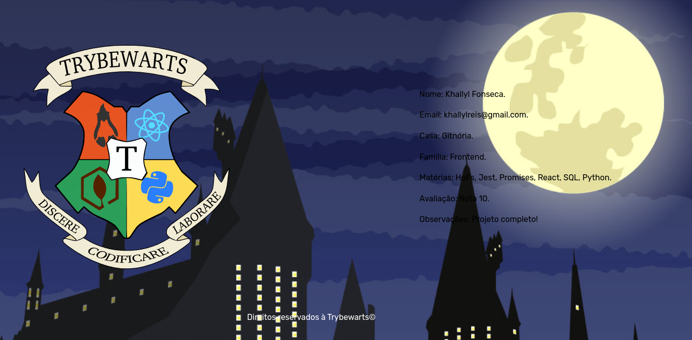

# Seja muito bem-vindo(a) ao meu projeto Trybewarts! :rocket:

Neste projeto realizeei em grupo, a confecção de um forms responsivo com HTML, CSS e JavaScript!

## Link para acessar o projeto
### <b> <a href="https://khallylreisfonseca.github.io/Trybewarts-Project/">Trybewarts</a> </b>  

## Screenshot

## Objetivos
  * Criar um forms;
  * Estilizar o forms com flexbox;
  * Deixar o forms responsivo com JavaScript;
  * Utilizar o metodo de preventDefault;

## Tecnologias usadas
  * HTML
  * CSS
  * Javacript
  * DOM
  * HTML Semântico  

## Como usar
  Basta digitar suas informações e enviar! Sera gerado um novo formulario com todas as informações preenchidas!
   
   
